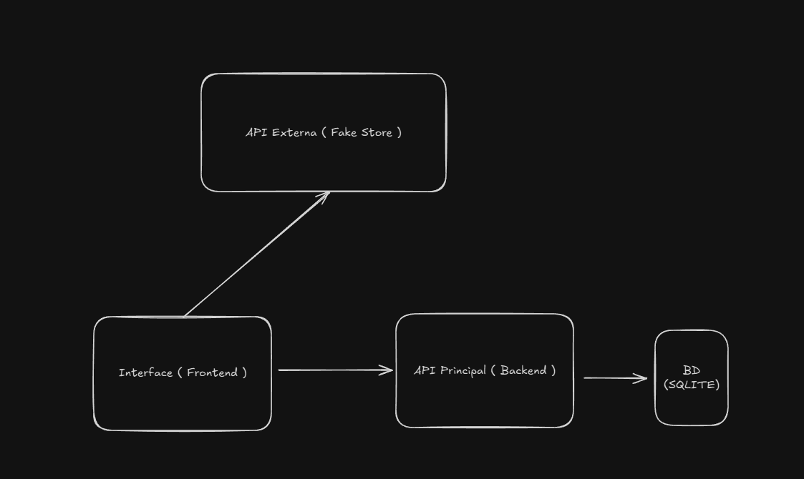

# 📚 Projeto Meus Livros (Backend)

Esta é uma API desenvolvida em Python utilizando o framework Flask. que permite a criação e gerenciamento de listas de desejos.

Projeto criado como MVP da sprint: Arquitetura de Software da pós-graduação em Engenharia de Software da PUC-Rio.

## 🗺️ Arquitetura do Projeto

Abaixo está um fluxograma representando a arquitetura do projeto, incluindo a interação entre o frontend, backend e o banco de dados:



## 🚀 Funcionalidades

- **Cadastrar Listas de Desejos**: Criação e gerenciamento de listas de desejos.
- **Adicionar Produtos**: Adição e gerenciamento de produtos na lista de desenos.

---

## 🛠️ Tecnologias Principais Utilizadas

- **Python 3.x**
- **Flask**
- **SQLite**

---

## ▶️ Como Rodar o Projeto

### Pré-requisitos

- **Python 3.x** instalado na máquina.
- Gerenciador de pacotes `pip` (instalado junto com Python).

### Passos

1. Clone o repositório:

```bash
git clone https://github.com/LucasEduMartins/meus-livros-backend.git
```

2. Crie um ambiente virtual e ative-o:

```bash
python -m venv venv
source venv/bin/activate # Linux/Mac
venv\Scripts\activate # Windows
```

3. Instale as dependências:

```bash
pip install -r requirements.txt
```

4. Execute a aplicação:

```bash
python app.py
```

A API estará disponível em [http://127.0.0.1:5000](http://127.0.0.1:5000).

---

## 📦 Como Rodar com Docker

1. Certifique-se de ter o Docker e o Docker Compose instalados na sua máquina.

2. Execute o comando abaixo para iniciar o container:

   ```bash
   docker-compose up
   ```

3. A API estará disponível em [http://127.0.0.1:5000](http://127.0.0.1:5000).

4. Para parar os containers, utilize:

   ```bash
   docker-compose down
   ```

O arquivo `docker-compose.yml` já está configurado para criar o ambiente necessário para rodar a aplicação.

---

## 📦 Documentação da API

Para obter informações detalhadas sobre os endpoints e como utilizar a API, consulte a [Documentação da API](http://127.0.0.1:5000/openapi/swagger#).

:::note
Certifique-se de ter a aplicação rodando para acessar a documentação da API.
:::
